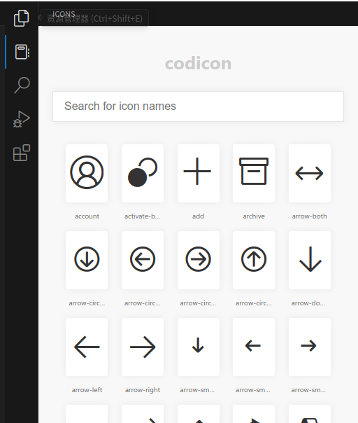
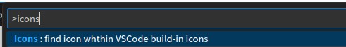
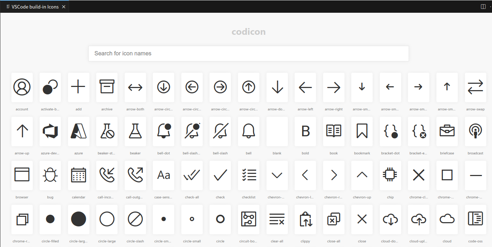

# VSCode build-in icons README

what this extension can do?
Help you quickly see all the icons build-in VSCode and search for the ones you want.

## useage: Icons in labels

Visual Studio Code contains a set of built-in icons that are contained in the [Codicon icon font](https://github.com/microsoft/vscode-codicons)!
When you develop extesions for vscode, you can use icon directly.

Icons can be used in Markdown labels in hovers, in the StatusBarItem text and QuickPickItem label API. The syntax for adding an icon in Markdown is :$(iconIdentifier)

```text
$(alert);
```

more details in the [documentation](https://code.visualstudio.com/api/references/icons-in-labels).  

## Features

There are two ways to enter:

### 1. Click on the sidebar icon



### 2. with 'ctrl + shift + p' type'Icons: find'





## Known Issues

[Calling out known issues can help limit users opening duplicate issues against your extension.](https://github.com/EvilJoker/vscode-extension-icons/issues)

**Enjoy!**
